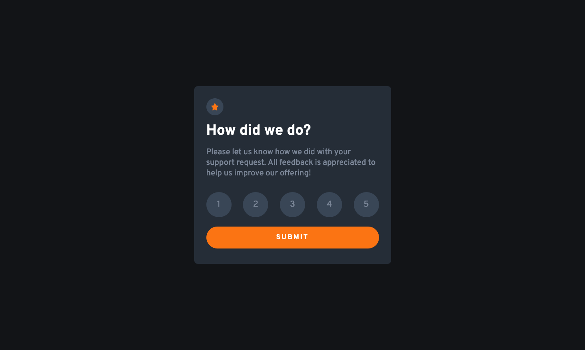
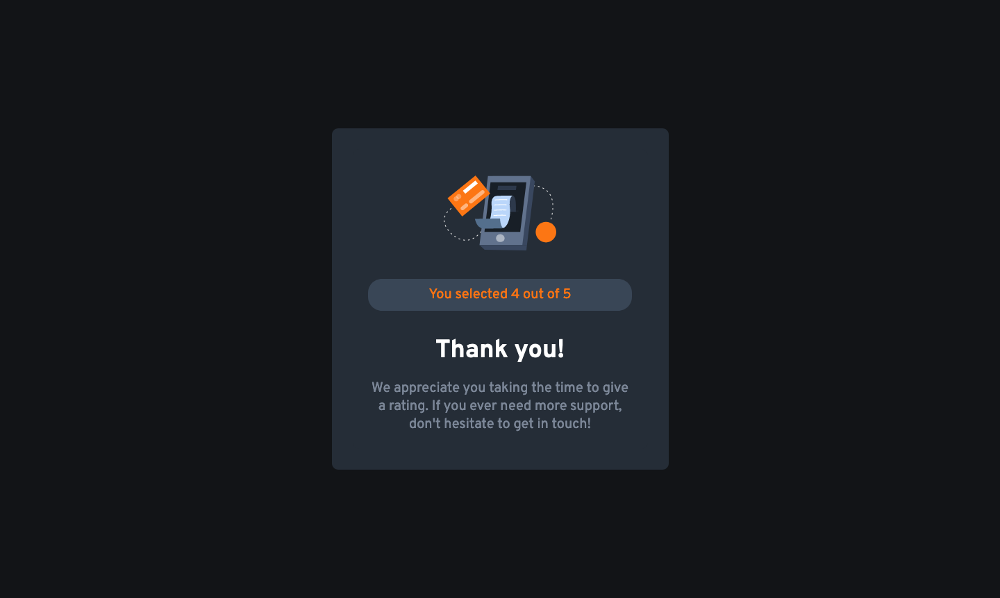
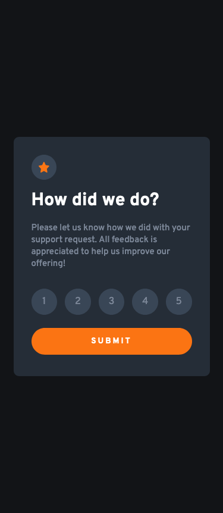
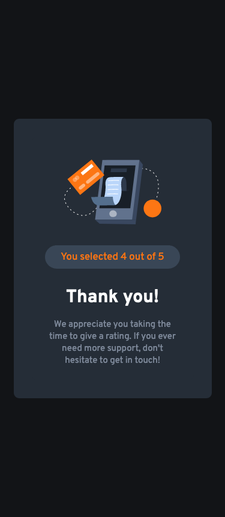

# Frontend Mentor - Interactive rating component solution

This is my solution to the [Interactive rating component challenge on Frontend Mentor](https://www.frontendmentor.io/challenges/interactive-rating-component-koxpeBUmI). Frontend Mentor challenges help you improve your coding skills by building realistic projects. 

## Table of contents

- [Overview](#overview)
  - [The challenge](#the-challenge)
  - [Screenshot](#screenshot)
  - [Links](#links)
- [My process](#my-process)
  - [Built with](#built-with)
  - [What I learned](#what-i-learned)
  - [Useful Resources](#useful-resources)
- [Author](#author)

## Overview

### The challenge

Users should be able to:

- View the optimal layout for the app depending on their device's screen size
- See hover states for all interactive elements on the page
- Select and submit a number rating
- See the "Thank you" card state after submitting a rating

### Screenshot

#### Desktop





#### Mobile





### Links

- Solution URL: https://www.frontendmentor.io/solutions/interactive-rating-component-built-with-react-07fgl5nyLd
- Live Site URL: https://rating-component-9fb0b9.netlify.app/

## My process

### Built with

- Semantic HTML5 markup
- CSS custom properties
- Flexbox
- Mobile-first workflow
- [React](https://reactjs.org/) - JS library

### What I learned

This is another project where I wanted to practice my React skills. I am currently in the middle of [Scrimba.com's 'React Basics' course](https://scrimba.com/learn/frontend), but I felt I need a little extra practice. 

This project gave me the opportunity to reinforce the concepts of `useState()` and `props`.

I'm particuarly proud of using a ternary operators in this project. For example, I used one to change the CSS styles of the labels when a user selects a choice: 
```javascript
className={formData.formValue === '1' ? 
  'form--label selected' : 
  'form--label'}
```
If the user has selected an option, then the state is updated with that value. Since the value is stored in state, I made use of it by letting it determine which CSS classes to the label so that the color of the label would change to match the user's selection.

### Useful Resources 

- [Vite documentation on assets](https://vitejs.dev/guide/assets.html) - This documentation helped me resolve the issue of the images not loading properly during deployment. Special thanks to [Bob Ziroll](https://github.com/bobziroll) for sharing this in the Scrimba Discord community when someone else had the same issue.

## Author

- <a href="mailto:msg.for.anthony.p6ht3@simplelogin.com?subject=Nice GitHub Project&body=Hey Anthony, I saw your GitHub project. Let's talk!">Email</a>
- [LinkedIn](https://linkedin.com/in/anthonynanfito)
- [Portfolio](https://ananfito.github.io)
- [Blog](https://ananfito.hashnode.dev)
